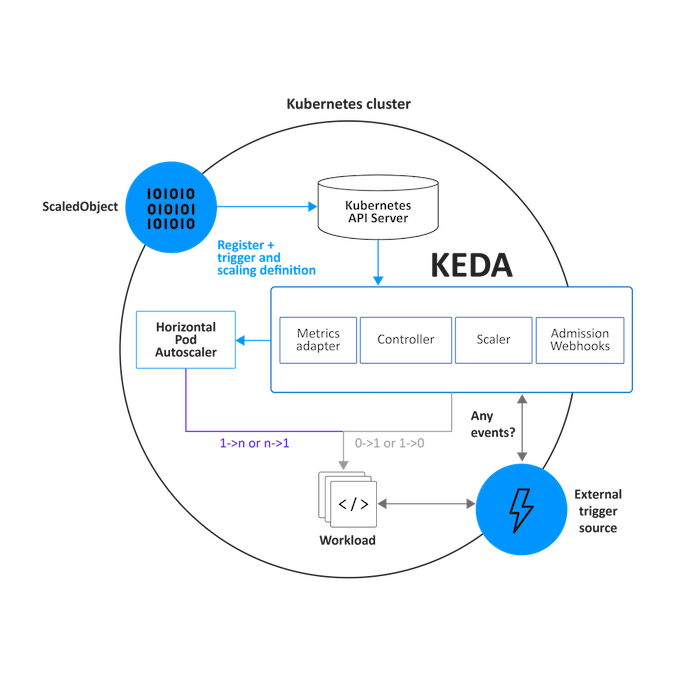

# KEDA Architecture

## Overview

KEDA (Kubernetes Event-driven Autoscaling) is an open-source component that enables Kubernetes to scale applications based on external events. It integrates seamlessly with the Horizontal Pod Autoscaler (HPA) to provide dynamic scaling based on various event sources.

## Architecture

KEDA's architecture consists of several key components that work together to scale workloads based on external events. The architecture includes:

- **Horizontal Pod Autoscaler (HPA)**: KEDA extends the HPA functionality by allowing it to scale applications based on external metrics.
  
- **External Event Sources**: KEDA supports a variety of external event sources, which can trigger scaling actions based on specific events. Examples include message queues, databases, and custom metrics.

- **etcd**: KEDA uses the etcd data store to manage the state of the scaled applications and to track the metrics that influence scaling decisions.

### Visual Representation

*Adapted from KEDA Documentation*

## How It Works

1. **Event Monitoring**: KEDA monitors the defined external event sources for specific metrics or events.
2. **Scaling Decisions**: Based on the events detected, KEDA makes scaling decisions, adjusting the number of replicas of the target application accordingly.
3. **Integration with HPA**: KEDA's metrics are fed into the Kubernetes HPA, which then manages the scaling of the application pods.

## Conclusion

KEDA allows for powerful and flexible autoscaling in Kubernetes environments, making it easier to handle workloads that are event-driven.

## References

- [KEDA Documentation](https://keda.sh/docs/)
